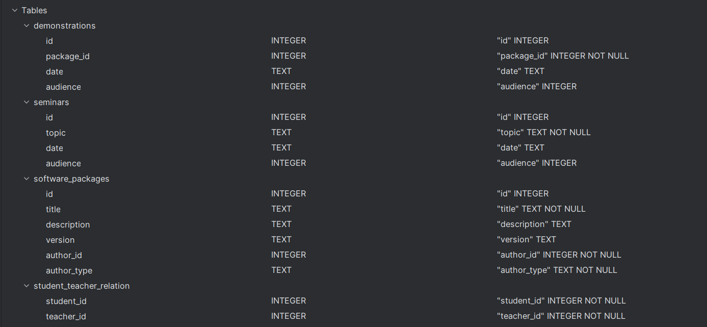
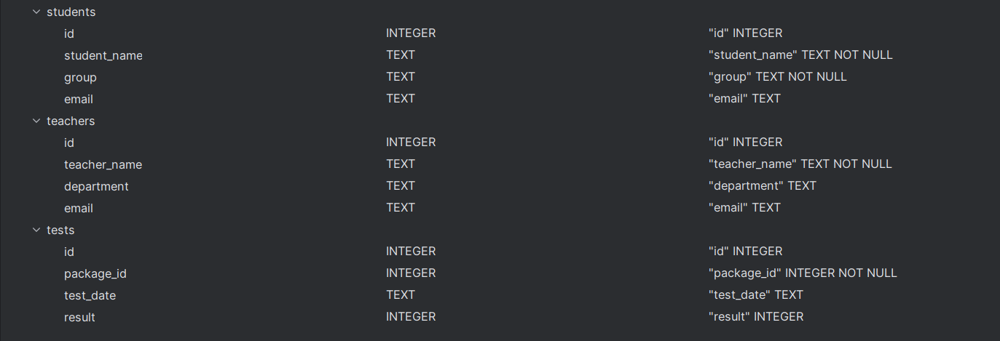
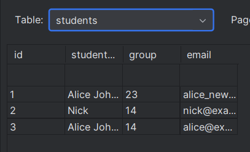

# software-package-system

* **Main**  
contains interactive menu for all the tables methods with processing user input and passing it to those methods  
     * _build_ : `cabal build`
     * _run_ : `cabal run`
- - -
* **Test case All Methods**  
contains the test scenario for all the methods to check their work all at once
     * _build_ : `cabal build test-all-methods`
     * _run_ : `cabal run test-all-methods`
---
**Database structure**

Students table inserts example:

